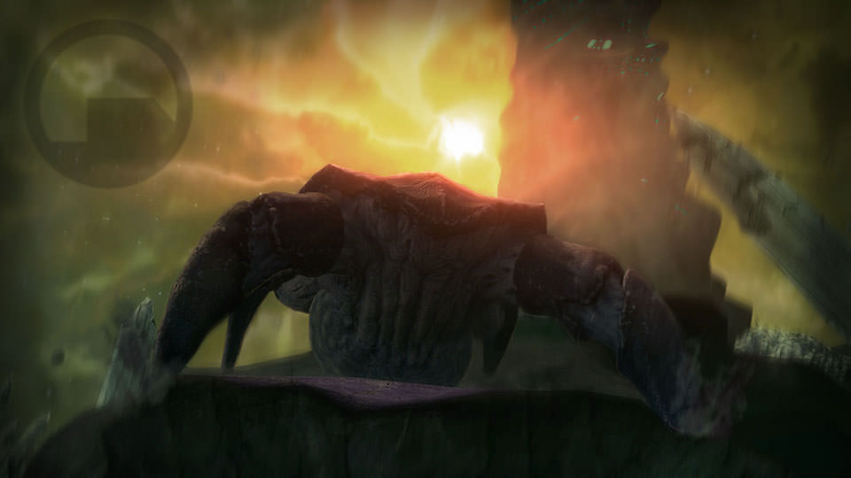
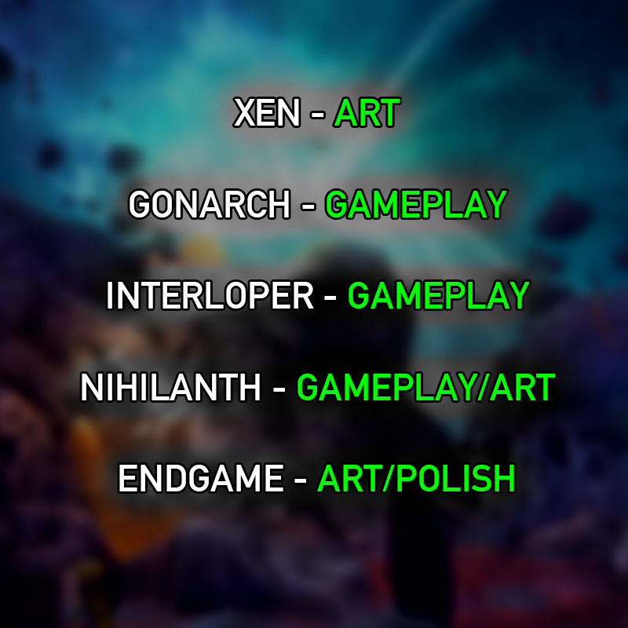
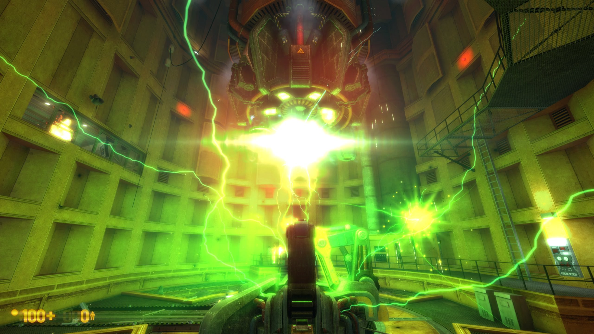
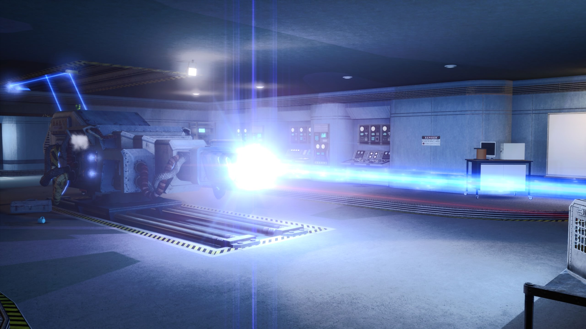
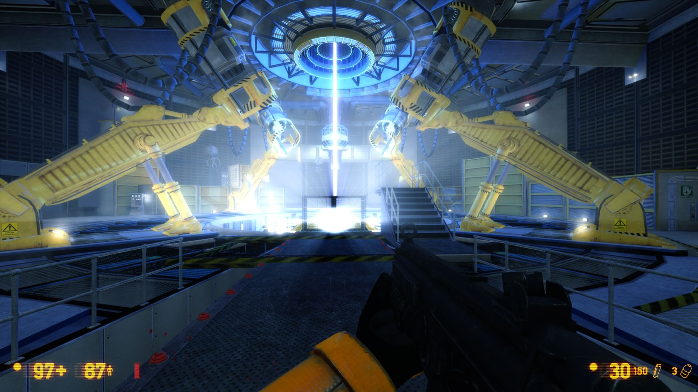
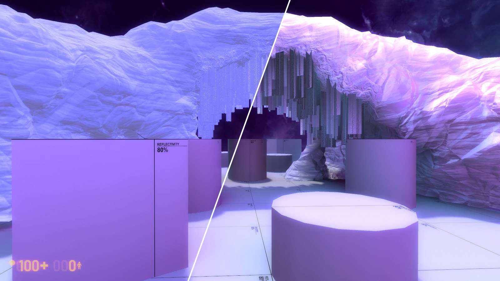

## Steam Sale, December Update, and Patch Notes

```
Tips: BYT,17038506 copy by [https://steamcommunity.com/games/362890/announcements/detail/1594703306631918308]   :D
```

24 DECEMBER, 2017	[- [BMS] ADAM-BOMB](https://steamcommunity.com/id/adam-bomb)



Happy Holidays, and happy Steam Winter Sale everyone! [Black Mesa is currently $4.99, our largest discount yet.](http://store.steampowered.com/app/362890/Black_Mesa/)


We released an update for Black Mesa **(currently on public beta)** that adds real-time dynamic lights, lens flares, god rays, and a host of other features to the existing earthbound sections of the game. The goal of this update is to get the released version of the game as close to our internal build as possible. This way, the final Xen release can be closer to a simple map drop; with less potential for engine and code issues affecting players on their first time playing Xen. We are hoping to test the engine and solve all feature and performance problems before the real release, so that everyone can enjoy our definitive vision of the game without issues.

As promised, here is an update on where we are at with developing the Xen chapters. 



We are striving to make sure Xen is fun, well thought-out, and cohesive. Each chapter has its own theme and artstyle, and we are developing them in parallel to ensure they are all at the same high standard of quality. Xen, in its current form, is made up of 14 maps across these final 5 chapters, with each map alone being significantly larger than the originals. We are putting our full effort into completing Xen in a timely manner so that everyone can have the complete Black Mesa experience!


### Screenshots From the Update







### Upcoming Feature

##### **Improved Prop Lighting**

While developing Xen, we realized the existing Source lighting just wasn't accurate enough. In the original Source, up to 4 lights are allowed per object and there is no self-shadowing. This works fine for small or medium sized objects, but for something like a massive, detailed rock archway, the limitations appear. In the screenshot, the vines hanging under the arch do not appear properly in shadow, and the arch looks strangely flat because only 4 light samples are being taken.


Our new static lighting supports all the nearby lights in the scene, self-shadows correctly, and also works seamlessly with both our new skydome lighting and our new dynamic lights. This makes a big difference "merging" the objects with their environment. 


Left is the old style of prop lighting, Right is the new:



The new lighting is much less flat overall, displays colours which are truer to the scene’s real tone, and shadows in a much more appealing and realistic manner.


### Patch Notes

##### **New Features**

1. Dynamic Lights - Full featured dynamic lights that are able to cast real time shadows, project textures, and emit volumetric light (godrays). These have been implemented across earthbound to help amp up the visual fidelity and “nextgen-ness”.

2. Lens Flares - New entity that creates a lens flare with customizable colors, styles, and effects. These have been implemented across earthbound too; only on lights we deemed very bright or important enough to warrant a lens flare.

3. Overhauled CSM and Godrays - Cascade Shadow Maps (CSM) have been totally rewritten and now run better than before. Godrays are completely overhauled to run smoother and operate off of a new entity that automatically gets the sun angle from the environment light. 

4. New Crossbow Scope - Crossbow scope no longer uses an in game camera to zoom in. This makes the scope easier to aim and increases performance by removing a second rendering pass. It also fixes a number of visual bugs with using the scope throughout the game. 

5. Image Based Ambient Lighting - Lighting can now be generated based off of the skybox image. This allows mappers to have significantly more accurate environmental lighting, which automatically takes into account the nuances and difference colours of the sky. This is unlike any other version of Source, where environment lighting is simply one flat colour picked by the mapper.

6. 4 Way Texture Support - 4 way texture blends are now supported in engine, each with their own bump map, specular map, and procedural blending options. This allows for much more variety in texturing natural landscapes, as most older versions of Source only support 2 way texture blends.

7. Color Correction - All existing earthbound maps now utilize color correction.

8. Better Hammer Compiles - Hammer now uses current windows themes and the compiler does not block you from continuing to use Hammer; running in a separate batch window (similar to CSGO).

9. Added Support for $treesway - Props can now move in the wind using tree sway. This creates more much more dynamic looking natural environments, with a very small performance cost.

10. Implemented Hammer Instance Support - Hammer can now instance other VMFs to support modular level design.

11. Improved Blood Particles - Updated and improved blood particle effects for NPCs, to not look as blocky and unrealistic.

12. New Long Jump Mechanics - Modified long jump mechanics to be more similar to modern day games (press “jump” twice to long jump). Added a long jump recharge meter and “mana” mechanic to keep people from spamming long jump in both single and multiplayer (the long jump has a limited charge, with a medium base recharge rate, and the jumps consume this charge). Added a small “pop jump” mechanic to allow course corrects while player is mid air.

13. Dynamic Light Implementation - Moved all existing old Source dynamic lights over to our new dynamic lights system. This should improve visuals and reduce hitching when a dynamic light is activated (such as explosions, flashlight, Xen portal, muzzle flash, etc).

14. Doubled Source Displacement Limit - Max number of displacements allowed per map from 2048 to 4096. This allows the creation of more detailed and expansive natural outdoor environments.

15. Fixed Hammer Shaded Textured View - No more horrendous fullbright mapping!

   ​


### Bug Fixes 

##### **NPCs**

* Fixed HECU not holding weapons correctly


* Fixed scientist ties jiggling out of control when FPS is low


* Fixed instances where Vort would not react to player


* Fixed ragdoll errors after loading a saved game


* Fixed rappelling HECU sometimes getting stuck in Osprey


* Fixed helicopter rockets getting stuck underwater


* Fixed grenade throw mechanics, grenades should be much easier to throw now


* Fixed crash from blowing up zombie HECU


* Fixed HECU turrets not shooting at zombie HECU


* Added IK (Inverse Kinematics) setup on Houndeye/Bullsquid


* Fixed Houndeye hitboxes, ragdoll, and gibs


* Added glow back to Houndeye’s blue stripes


* Fixed skinning on Houndeye


* Fixed player being able to pick up assassin’s pistol


* Fixed and improved Alien Controller AI and combat


* Fixed Agrunt hornet tracking to be more fair, making the Agunts more fun to fight


* Updated Vort eyes


* Fixed Vorts getting stuck after loading a save game

##### **Multiplayer**

* Added HUD icon for players using voice chat in multiplayer


* Added hit indicators in multiplayer


* Fixed UI spectate bugs in multiplayer


* Increased crossbow zoom sensitivity in multiplayer


* Fixed satchel being able to be thrown through the ground


* Fixed TOW launchers in Crossfire breaking if you moved them too much


* Fix fast weapon switch getting turned off in multiplayer


* Fixed ent_create not respecting sv_cheats 


* Fixed filter_damage being able to crash servers

##### **Miscellaneous**

* Temporarily removed blood on weapons and hands, to fix the engine hitching when the effect is first applied


* Fixed Tau firing with limited ammo. The Tau will not longer auto fire if you do not have enough ammo for a full charge.


* Fixed Tau overcharge not hurting the player


* Fixed soundscapes not playing underwater


* Fixed maps crashing if there were no lights in VMF


* Fixed UI errors with certain translation files (Russian, Chinese)


* Fixed shotgun shells disappearing during reload animation


* Fixed missing translations in Italian closed captions


* Split last map of Lambda Core into two maps, for better performance 


* Fixed VRAD to always pay attention to “Disable Vertex Lighting” in Hammer


* Fixed crossbow aiming too high when zoomed in


* Fixed various crashes and bugs when using the workshop tools


### Known Issues

* Dynamic light shadows sometimes flicker


* Wall decals sometimes flicker


* Props sometimes “pop” with different lighting values


* Shadows from dynamic lights sometimes flicker on surfaces tangent to light, or when light is moving very fast


* When using dynamic light godrays, the game is slightly blurred


* Player occasionally gets stuck in Inbound tram when turning corner; issue fixes itself


* Cameras in game are off angle


* Gman gibs are wrong in multiplayer


* Crossbow will force you to descope after firing a shot in multiplayer

  ​

**Thanks!**

**-The Black Mesa Team**